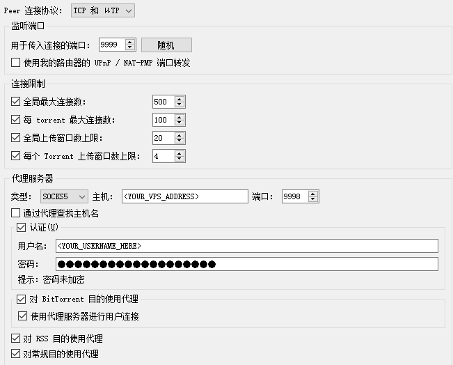

# AutoTorrentProxy
[English Readme](README_EN.md)

基于[frp](https://github.com/fatedier/frp)和[gost](https://github.com/ginuerzh/gost)的自动Torrent代理部署脚本

`TorrentDeploy.sh`可以完成如下内容：

- 自动下载frp和gost工具
- 自动编写和配置服务

`Cleanup.sh`可以完成如下内容：

- 自动删除`TorrentDeploy.sh`所配置的服务

## 使用方法

1. 将仓库clone到**代理服务器**
``` shell
git clone https://github.com/ShuiChang2019/AutoTorrentProxy.git
```

2. 修改`/config/frps.toml`和`/configs/gost.ini`配置。示例：
``` ini
# frps.toml
[common]
bindPort = 7000
bind_udp_port = 7000
bind_addr = "0.0.0.0"
allow_ports = "1001-7001,10001-22500"
token = "<YOUR_TOKEN_HERE>"
tls_only = true
```

``` ini
# gost.ini
[gost_conf]
username=<YOUR_USERNAME_HERE>
password=<YOUR_PASSWORD_HERE>
ip_addr=0.0.0.0
port=<YOUR_PORT_HERE>
```

3. 在**代理服务器**上运行`TorrentDeploy.sh`。（注意：涉及写服务操作需要sudo权限）
``` shell
cd AutoTorrentProxy
bash TorrentDeploy.sh
```
    
参数：

``` plain
-f： 指定frps.toml配置文件路径 （默认为./AutoTorrentProxy/config/frps.toml）
-g： 指定gost.ini配置文件路径 （默认为./AutoTorrentProxy/config/gost.ini）
-p： 指定脚本所用的代理服务器（如http://1.2.3.4:7890）
```

4. 在**运行torrent的客户端**上修改配置。
    - 修改`frpc.toml`。示例：（注：`[common]`中的`token`需要与`frps.toml`中的`token`一致）

    ``` ini
    [common]
    server_addr = "<YOUR_VPS_ADDRESS>"
    server_port = 7000
    token = "<YOUR_TOKEN_HERE>"
    tls_enable = true

    [[proxies]]
    name = "Remote Download"
    type = "tcp"
    local_ip = "127.0.0.1"
    local_port = 2333
    remote_port = 2333

    [[proxies]]
    name = "BT Listen TCP"
    type = "tcp"
    local_ip = "127.0.0.1"
    local_port = <YOUR_LOCAL_BT_PORT>
    remote_port = <YOUR_LOCAL_BT_PORT>

    [[proxies]]
    name = "BT Listen UDP"
    type = "udp"
    local_ip = "127.0.0.1"
    local_port = <YOUR_LOCAL_BT_PORT>
    remote_port = <YOUR_LOCAL_BT_PORT>

    [[proxies]]
    name = "eMule Listen TCP"
    type = "tcp"
    local_ip = "127.0.0.1"
    local_port = 22224
    remote_port = 22224

    [[proxies]]
    name = "eMule Listen UDP"
    type = "udp"
    local_ip = "127.0.0.1"
    local_port = 22224
    remote_port = 22224
    ```

    - 运行frp客户端`frpc`：
    ``` shell
    frpc -c frpc.toml
    ```

    - 修改torrent软件的配置（以[qBittorrent](https://github.com/qbittorrent/qBittorrent)为例）
    
    注：传入连接为frp端口，代理服务器为gost地址、端口、用户名、密码


5. （可选）验证torrent是否代理成功：如使用[Torguard](`https://torguard.net/checkmytorrentipaddress.php`)查看下载地址是否为代理服务器的地址

6. （删除服务和清理）在**代理服务器**上运行`Cleanup.sh`（注意：涉及删除服务操作需要sudo权限）
``` shell
bash Cleanup.sh
```


