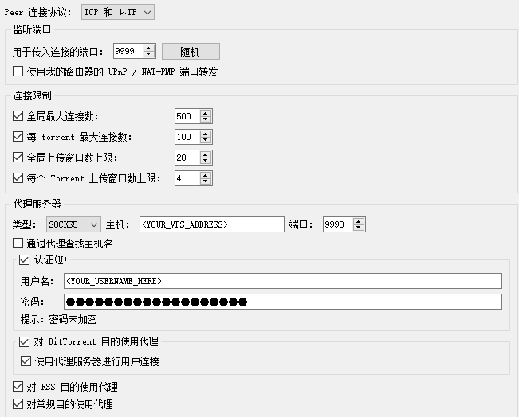

# AutoTorrentProxy
[汉语 Readme](README.md)

Automatic torrent proxy deployment script based on [frp](https://github.com/fatedier/frp) and [gost](https://github.com/ginuerzh/gost)

`TorrentDeploy.sh` can perform the following actions:

- Automatically download the frp and gost tools
- Automatically generate and configure the services

`Cleanup.sh` can perform the following actions:

- Automatically remove the services configured by `TorrentDeploy.sh`

## Usage

1. Clone the repository to the **proxy server**:

``` shell
git clone https://github.com/ShuiChang2019/AutoTorrentProxy.git
```

2. Modify the `/config/frps.toml` and `/configs/gost.ini` configuration files. Example:
``` ini
# frps.toml
[common]
bindPort = 7000
bind_udp_port = 7000
bind_addr = "0.0.0.0"
allow_ports = "1001-7001,10001-22500"
token = "<YOUR_TOKEN_HERE>"
tls_only = true
```

``` ini
# gost.ini
[gost_conf]
username=<YOUR_USERNAME_HERE>
password=<YOUR_PASSWORD_HERE>
ip_addr=0.0.0.0
port=<YOUR_PORT_HERE>
```

3. Run `TorrentDeploy.sh` on the **proxy server**. (Note: sudo permissions are required for service-related operations)

``` shell
cd AutoTorrentProxy
bash TorrentDeploy.sh
```

Parameters:

``` plain
-f: Specify the path to the frps.toml configuration file (./AutoTorrentProxy/config/frps.toml by default)
-g: Specify the path to the gost.ini configuration file (./AutoTorrentProxy/config/gost.ini by default)
-p: Specify the proxy server used by the script (e.g., http://1.2.3.4:7890)
```

4. Modify the configuration on the **host running the torrent clinet**.

    - Modify `frpc.toml`. Example: (Note: The `token` in [common] must match the `token` in `frps.toml`)
    ``` ini
    [common]
    server_addr = "<YOUR_VPS_ADDRESS>"
    server_port = 7000
    token = "<YOUR_TOKEN_HERE>"
    tls_enable = true

    [[proxies]]
    name = "Remote Download"
    type = "tcp"
    local_ip = "127.0.0.1"
    local_port = 2333
    remote_port = 2333

    [[proxies]]
    name = "BT Listen TCP"
    type = "tcp"
    local_ip = "127.0.0.1"
    local_port = <YOUR_LOCAL_BT_PORT>
    remote_port = <YOUR_LOCAL_BT_PORT>

    [[proxies]]
    name = "BT Listen UDP"
    type = "udp"
    local_ip = "127.0.0.1"
    local_port = <YOUR_LOCAL_BT_PORT>
    remote_port = <YOUR_LOCAL_BT_PORT>

    [[proxies]]
    name = "eMule Listen TCP"
    type = "tcp"
    local_ip = "127.0.0.1"
    local_port = 22224
    remote_port = 22224

    [[proxies]]
    name = "eMule Listen UDP"
    type = "udp"
    local_ip = "127.0.0.1"
    local_port = 22224
    remote_port = 22224
    ```

    - Run the frp client `frpc`:
    ``` shell
    frpc -c frpc.toml
    ``` 

    - Modify the torrent software configuration (example using [qBittorrent](https://github.com/qbittorrent/qBittorrent)):
    
    
5. (Optional) Verify if the torrent proxy is successful: Use [Torguard](`https://torguard.net/checkmytorrentipaddress.php`) or similar tools to check if the download address matches the proxy server's address.

6. (Delete services and clean up) Run `Cleanup.sh` on the **proxy server**. (Note: sudo permissions are required for service-related operations):
``` shell
bash Cleanup.sh
```

